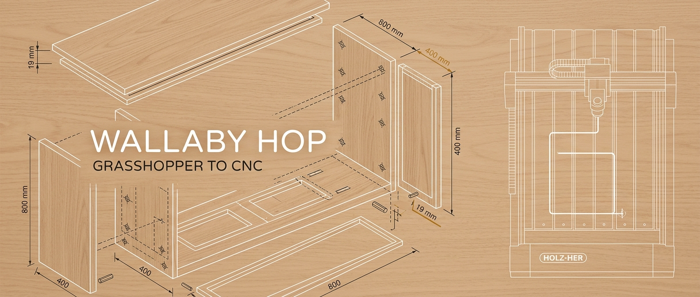

<div align="center">



# 🪚 Wallaby Hop

**A Grasshopper plugin that turns parametric Rhino geometry into production-ready `.hop` NC files for HOLZ-HER CNC machines — no manual NC coding, no HOPS GUI.**

[](./LICENSE)
[](https://www.rhino3d.com/)
[](https://dotnet.microsoft.com/)
[](https://docs.microsoft.com/dotnet/csharp/)
[](#installation)
[](https://www.direkt.net/)

</div>

Design furniture and panel parts parametrically in Rhino/Grasshopper, wire components together, and export production-ready `.hop` files directly. The plugin emits the macro language interpreted by the **HOLZHER CAMPUS** controller (drilling, milling, sawing, pocketing, hinge cups, fixing clamps, full cabinet carcasses, OpenNest-based nesting). 152 snapshot tests on the NC-output formatter make sure a tested machine program stays a tested machine program.

Built for the **HOLZ-HER DYNESTIC 7535** controlled via **HOPS 7.7** + **HOLZHER CAMPUS**, but the macro emitters are isolated — porting to another HOPS-compatible machine is an afternoon of renaming, not a rewrite.

> **2.5D only.** XY + vertical Z plunge. 3D milling and 5-axis paths are out of scope. The plugin trusts your tool magazine for feeds, speeds, and approach behavior — it writes positions and tool numbers, the controller resolves the rest.

---

## Contents

- [Why this exists](#why-this-exists)
- [How it works](#how-it-works)
- [Installation](#installation)
- [The `.hop` file format](#the-hop-file-format)
- [Component reference](#component-reference)
  - [Drilling](#drilling)
  - [Milling](#milling)
  - [Sawing](#sawing)
  - [Hardware](#hardware)
  - [Export](#export)
  - [Cabinet](#cabinet)
  - [Nesting](#nesting)
  - [Drawing](#drawing)
  - [Utility](#utility)
- [AutoWire](#autowire)
- [Typical workflows](#typical-workflows)
- [Machine & software notes](#machine--software-notes)
- [Gotchas (read before changing anything)](#gotchas-read-before-changing-anything)
- [Development](#development)
- [License](#license)
- [Sibling project](#sibling-project)

---

## Why this exists

If you've ever sat in front of HOPS trying to click-build a cabinet program by hand, you already know. The macro language is powerful but documented mostly through CAMPUS examples. The GUI is fine for one-offs and miserable for parametric variants — change a dimension and you click the same fifty buttons again.

**Wallaby Hop moves the design step into Grasshopper.** You author parts as Rhino geometry + GH parameters, the plugin emits the exact same `Bohrung()`, `CALL _Rechteck_V7()`, `WZB/WZF/WZS` macro calls CAMPUS expects, and you skip the GUI entirely. A `HopKorpus` component generates a full carcass from `W × H × D`; an OpenNest pipeline emits one `.hop` per nested part; a `HopAnalyzer` checks SP/EP structural correctness before you walk the file to the machine.

---

## How it works

```
[Geometry / Points / Curves]
        ↓
[Operation Components]   →   operationLines (List<string>)
        ↓
[HopExport]              →   hopContent (string) + .hop file on disk
        ↓
[HopAnalyzer]            →   isValid / errors (optional validation step)
```

Each operation component (`HopDrill`, `HopContour`, etc.) takes Grasshopper geometry as input and outputs a `List<string>` — a list of NC-Hops macro call strings. **HopExport** collects these lists, sorts them by tool type (WZB → WZF → WZS), assembles the file header, VARS block, and START section, then writes a syntactically valid `.hop` file. **HopAnalyzer** can validate the final output before machining.

The `.hop` format is not G-code. It is a macro language interpreted by the HOLZHER CAMPUS controller. Each line like `Bohrung(...)` or `CALL _Rechteck_V7(...)` is a machine-side subroutine call — the controller handles feed rates, Z-homing, and tool approach internally.

---

## Installation

**Requirements:**

- Rhino 7 or 8
- Grasshopper (included with Rhino)
- Visual Studio 2022 with .NET Framework 4.8 SDK (build only)

**Steps:**

1. Clone the repo and open the solution:
   ```
   src/DynesticPostProcessor/DynesticPostProcessor.csproj
   ```
2. Build in Release. The post-build step automatically copies `WallabyHop.gha` to:
   ```
   %AppData%\Grasshopper\Libraries\
   ```
3. Restart Rhino. The components appear in the **Wallaby Hop** tab in the Grasshopper toolbar.

A pre-built `.yak` distribution via the Rhino Package Manager is planned (`manifest.yml` already prepared) but not yet published.

---

## The `.hop` file format

A `.hop` file is a plain ASCII text file with CRLF line endings. It has three sections:

```
;MAKROTYP=0              ← File header (comment lines starting with ;)
;MASCHINE=HOLZHER
;NCNAME=my_part
;DX=0.000
...

VARS                     ← Variable declarations
   DX := 800.0;*VAR*Dimension X
   DY := 400.0;*VAR*Dimension Y
   DZ := 19.0;*VAR*Dimension Z

START                    ← Program body
Fertigteil (DX,DY,DZ,0,0,0,0,0,'',0,0,0)
CALL HH_Park ( VAL PARK:=3,X:=0,Y:=0)
WZB (5,_VE,_V*1,_VA,_SD,0,'')          ← Tool call
Bohrung (100.0,200.0,19.0,2.0,8.0,0,0,0,0,0,0,0)   ← Operation macro
```

**Key macros used by this plugin:**

| Macro | Operation | Component |
|-------|-----------|-----------|
| `Bohrung(x,y,surfZ,cutZ,dia,...)` | Vertical drill | HopDrill |
| `CALL _Bohgx_V5(...)` / `_Bohgy_V5(...)` | Drill row (X/Y) | HopDrillRow |
| `SP(...)` / `G01(...)` / `G02M(...)` / `G03M(...)` / `EP(...)` | Contour / engraving path | HopContour, HopEngraving |
| `CALL _Rechteck_V7(...)` | Rectangular pocket | HopRectPocket |
| `CALL _Kreistasche_V5(...)` | Circular pocket | HopCircPocket |
| `CALL _Kreisbahn_V5(...)` | Circular path | HopCircPath |
| `CALL _nuten_frei_v5(...)` | Free slot | HopFreeSlot |
| `CALL _Nuten_X_V5(...)` / `_Nuten_Y_V5(...)` | Groove slot (X/Y axis) | HopGrooveSlot |
| `CALL _saege_x_V7(...)` / `_saege_y_V7(...)` | Format saw cut | HopFormatCut |
| `WZS(...)` + `_nuten_frei_v5(...)` | Freeform/miter saw cut | HopSaw |
| `CALL _Topf_V5(...)` | Blum hinge cup drill | HopBlumHinge |
| `/CALL Fixchip_K ( VAL SPX:=..,SPY:=..,SPZ:=..,WKLXY:=..)` | Fixing clamp | HopFixchip |
| `CALL B2Punkte_V7(...)` | Dimension line markup | HopDimension |
| `WZB(...)` | Drill tool call | All WZB ops |
| `WZF(...)` | Milling tool call | All WZF ops |
| `WZS(...)` | Saw tool call | All WZS ops |

---

## Component reference

All components live in the **Wallaby Hop** tab in Grasshopper. Subcategories group them by operation type.

---

### Drilling

#### HopDrill

Converts a list of 3D points into vertical drilling operations.

**NC macro:** `Bohrung(...)`

| Input | Type | Description |
|-------|------|-------------|
| `points` | Point3d list | Drill positions. Z of highest point = plate surface. |
| `depth` | float | Drilling depth in mm. Default: 1.0 |
| `diameter` | float | Drill diameter in mm. Default: 8.0 |
| `stepdown` | float | Depth per pass for peck drilling. 0 = single pass. |
| `toolNr` | int | Tool magazine position (must be > 0) |
| `colour` | Color | Viewport preview color |

| Output | Type | Description |
|--------|------|-------------|
| `operationLines` | string list | NC macro strings → wire into HopExport |

**Notes:**
- `surfaceZ` auto-derived as max Z across all input points.
- With `stepdown > 0`, drilling is split into multiple Bohrung passes at increasing depth.
- Renders translucent drill cylinders in the Rhino viewport.

---

#### HopDrillRow

Generates a parametric row of holes along the X or Y axis using the `_Bohgx_V5` / `_Bohgy_V5` macros. The row is defined by a start point plus up to 4 incremental spacings (`BIX..BIIIIX` / `BIY..BIIIIY`).

**NC macro:** `CALL _Bohgx_V5(...)` or `CALL _Bohgy_V5(...)`

| Input | Type | Description |
|-------|------|-------------|
| `direction` | int | 0 = X-row (`_Bohgx_V5`), 1 = Y-row (`_Bohgy_V5`) |
| `startPoint` | Point3d | First hole position. Z = surface height. |
| `spacings` | float list | 1-4 incremental spacings between holes in mm. Unused = 0 (disabled). |
| `depth` | float | Drilling depth in mm. Default: 13 |
| `diameter` | float | Drill diameter in mm. Default: 5 |
| `mirror` | bool | Mirror the drill row (SPIEGELN). Default: false |
| `toolNr` | int | Tool magazine position |
| `colour` | Color | Viewport preview color |

---

### Milling

#### HopContour

Converts a planar curve into a 2D contour cutting path using `SP/G01/G02M/G03M/EP` macros. Handles both straight segments and arcs.

**NC macros:** `SP`, `G01`, `G02M`, `G03M`, `EP`

| Input | Type | Description |
|-------|------|-------------|
| `curve` | Curve | Planar closed or open curve. Must lie in or near World XY. |
| `depth` | float | Cutting depth in mm. Default: 1.0 |
| `leadIn` | float | Lead-in length in mm — approach from outside the contour. Default: 0 |
| `tolerance` | float | NURBS → polyline/arc conversion tolerance in mm. Default: 0.1 |
| `toolNr` | int | Tool magazine position |
| `toolDiameter` | float | Tool diameter for kerf offset. Default: 8.0 |
| `side` | int | Kerf compensation: +1 = left of travel, 0 = center, -1 = right of travel |
| `passes` | int | Number of passes for multi-pass cutting. Default: 1 |
| `overcut` | float | Extra depth in mm added as a final pass (e.g. 0.2 for full cut-through). Default: 0 |
| `leadOut` | float | Lead-out length in mm past the end point. Default: 0 |
| `autoFlip` | bool | Auto-reverse closed curves so the kerf offset lands on the outer side. Default: false |
| `cornerStyle` | int | Offset corner style: 0 = Sharp, 1 = Round, 2 = Smooth |
| `colour` | Color | Viewport preview color |

**Notes:**
- Lines → `G01`, arcs → `G02M`/`G03M` (CW/CCW from arc normal).
- Kerf compensation is geometric pre-offset — no machine-side G41/G42.
- With `passes > 1`, multiple full contour passes are generated.
- Renders a shaded toolpath volume in the viewport.

---

#### HopEngraving

Generates engraving paths for one or more curves. Follows the input curve exactly — no kerf offset. Designed for shallow cuts with V-bits or engraving spindles.

**NC macros:** `SP`, `G01`, `G02M`, `G03M`, `EP`

| Input | Type | Description |
|-------|------|-------------|
| `curves` | Curve list | One or more planar curves to engrave. |
| `depth` | float | Engraving depth in mm. Default: 0.5 |
| `tolerance` | float | NURBS conversion tolerance. Default: 0.05 |
| `toolNr` | int | Tool magazine position |
| `colour` | Color | Viewport preview color |

---

#### HopRectPocket

Generates a rectangular pocket using the `_Rechteck_V7` macro. Dimensions from the input curve's bounding box.

**NC macro:** `CALL _Rechteck_V7(...)`

| Input | Type | Description |
|-------|------|-------------|
| `rectCurve` | Curve | Closed rectangle curve. Center and size from bounding box. |
| `cornerRadius` | float | Fillet radius in mm. 0 = sharp corners. |
| `angle` | float | Rotation angle in degrees. 0 = axis-aligned. |
| `depth` | float | Pocket depth in mm. Default: 1.0 |
| `stepdown` | float | Depth per pass. 0 = single pass. |
| `toolNr` | int | Tool magazine position |
| `colour` | Color | Viewport preview color |

---

#### HopCircPocket

Generates a circular pocket using the `_Kreistasche_V5` macro.

**NC macro:** `CALL _Kreistasche_V5(...)`

| Input | Type | Description |
|-------|------|-------------|
| `center` | Point3d | Center of the pocket. Z = plate surface. |
| `radius` | float | Pocket radius in mm |
| `depth` | float | Pocket depth in mm. Default: 1.0 |
| `stepdown` | float | Depth per pass. 0 = single pass. |
| `toolNr` | int | Tool magazine position |
| `colour` | Color | Viewport preview color |

---

#### HopCircPath

Generates a circular profile cutting path using the `_Kreisbahn_V5` macro. Cuts along a circle (not a full pocket — path only).

**NC macro:** `CALL _Kreisbahn_V5(...)`

| Input | Type | Description |
|-------|------|-------------|
| `center` | Point3d | Center of the circular path. |
| `radius` | float | Path radius in mm |
| `radiusCorr` | int | Radius correction: -1 = outside, 0 = center, +1 = inside |
| `depth` | float | Cut depth in mm. Default: 1.0 |
| `stepdown` | float | Depth per pass. 0 = single pass. |
| `angle` | float | Arc angle in degrees. 360 = full circle. Default: 360. |
| `toolNr` | int | Tool magazine position |
| `colour` | Color | Viewport preview color |

---

#### HopFreeSlot

Generates a free slot between two points using the `_nuten_frei_v5` macro.

**NC macro:** `CALL _nuten_frei_v5(...)`

| Input | Type | Description |
|-------|------|-------------|
| `p1` | Point3d | Slot start point |
| `p2` | Point3d | Slot end point |
| `slotWidth` | float | Slot width in mm |
| `depth` | float | Slot depth in mm. Default: 1.0 |
| `toolNr` | int | Tool magazine position |
| `colour` | Color | Viewport preview color |

---

#### HopGrooveSlot

Generates axis-aligned groove operations using `_Nuten_X_V5` (runs in X) or `_Nuten_Y_V5` (runs in Y) macros. Typical use: shelf dado grooves, back panel grooves.

**NC macro:** `CALL _Nuten_X_V5(...)` or `CALL _Nuten_Y_V5(...)`

| Input | Type | Description |
|-------|------|-------------|
| `direction` | int | 0 = X-groove (`_Nuten_X_V5`), 1 = Y-groove (`_Nuten_Y_V5`) |
| `position` | Point3d list | Points on the groove center line, one groove per point. The edge distance (ARAND) is derived from the point: Y coordinate for an X-groove, X coordinate for a Y-groove. Panel origin must be at (0,0). |
| `width` | float | Groove width in mm (NB). Default: 8 |
| `depth` | float | Groove depth in mm (NT). Default: 8 |
| `ebene` | int | Reference plane flag (EBENE), 0 or 1. Default: 0 |
| `shortenStart` | float | Shorten the groove at its start in mm (ALINKS). Default: 0 = full length |
| `shortenEnd` | float | Shorten the groove at its end in mm (ARECHTS). Default: 0 = full length |
| `toolNr` | int | Tool magazine position |
| `colour` | Color | Viewport preview color |

**Notes:**
- The groove runs the full panel length minus `shortenStart`/`shortenEnd` — the position point only sets the edge distance (ARAND) and surface Z.
- The 600 mm preview length in the viewport is illustrative; the actual groove spans the panel.

---

### Sawing

#### HopFormatCut

Generates format saw cuts using the `_saege_x_V7` / `_saege_y_V7` macros. Used for straight trim cuts along X or Y axis, optionally with a miter/bevel angle (KW).

**NC macro:** `CALL _saege_x_V7(...)` or `CALL _saege_y_V7(...)`

| Input | Type | Description |
|-------|------|-------------|
| `direction` | int | 0 = X-cut (`_saege_x_V7`, saw travels in X at fixed Y), 1 = Y-cut (`_saege_y_V7`, travels in Y at fixed X) |
| `position` | Point3d list | Points on the cut lines, one cut per point. X-cut uses the Y coordinate, Y-cut uses the X coordinate. Z = surface height. |
| `thickness` | float | Material thickness = cut depth in mm. Default: 19 |
| `kw` | float | Bevel/miter angle in degrees (wedge angle). 0 = straight cut. Default: 0 |
| `length` | float | Saw travel length override in mm. 0 = use plate DX/DY. Default: 0 |
| `toolNr` | int | Saw tool magazine position |
| `colour` | Color | Viewport preview color |

---

#### HopSaw

Generates freeform saw cuts (WZS tool call + `_nuten_frei_v5`). For non-axis-aligned straight saw cuts, including tilted-blade miter cuts. Direction line and blade tilt are independent parameters.

**NC macro:** `WZS(...)` + `CALL _nuten_frei_v5(...)`

| Input | Type | Description |
|-------|------|-------------|
| `dirLine` | Curve list | Straight lines defining the XY travel path — one cut per line. Non-linear curves are refused. |
| `bladeAngle` | float list | Physical blade tilt in degrees (-90 to +90). 0 = vertical. Single value applies to all cuts, or supply a list matching `dirLine`. |
| `length` | float | Total cut length in mm, centered on each line's midpoint. 0 = use each line's own length (auto). Default: 0 |
| `sawKerf` | float | Blade kerf (cut width) in mm. Default: 3.2 |
| `depth` | float | Cut depth in mm from the plate surface. Default: 19 |
| `side` | int | Kerf placement (plugin standard, same as HopContour): +1 = left of dirLine, 0 = centered, -1 = right |
| `extend` | float | Extend the cut past both endpoints in mm (lets miter cuts exit the panel edge). Default: 0 |
| `toolNr` | int | Saw tool magazine position |
| `colour` | Color | Viewport preview color |

---

### Hardware

#### HopBlumHinge

Generates Blum cup hinge drilling operations (cup bore + mounting dowel holes) using the `_Topf_V5` macro.

**NC macro:** `CALL _Topf_V5(...)`

| Input | Type | Description |
|-------|------|-------------|
| `positions` | Point3d list | Hinge center positions. Y = hinge position along board, Z = surface height. |
| `distance` | float | Distance from board edge to cup center in mm (DISTANCE). Default: 22.5 |
| `side` | int | Reference edge: 0 = front (SEITE:=0), 1 = back (SEITE:=1). Default: 0 |
| `cupDiameter` | float | Cup bore diameter in mm (TOPF_D). Default: 35.0 |
| `cupDepth` | float | Cup bore depth in mm (TOPF_T). Default: 12.8 |
| `dowelDiameter` | float | Mounting dowel diameter in mm (DUEBEL_D). 0 = skip dowel holes. Default: 8 |
| `dowelDepth` | float | Mounting dowel depth in mm (DUEBEL_T). 0 = skip dowel holes. Default: 13 |
| `toolNr` | int | Tool magazine position |
| `colour` | Color | Viewport preview color |

---

#### HopFixchip

Generates fixing clamp positions using the `Fixchip_K` macro. Used to define clamping points that secure the workpiece during machining. No tool call — clamps are hardware, not cutters.

**NC macro:** `/CALL Fixchip_K ( VAL SPX:=..,SPY:=..,SPZ:=..,WKLXY:=..)`

| Input | Type | Description |
|-------|------|-------------|
| `positions` | Point3d list | Clamp center positions (SPX/SPY). Z = clamp height (SPZ) — machine files typically use HALF the plate thickness (e.g. 9.5 for 19 mm). |
| `angle` | float | Clamp rotation angle in degrees (WKLXY). Default: 0 |
| `skippable` | bool | Emit with a leading `/` so the operator can toggle the clamp block at the machine. Default: true |

**Notes:**
- HopAnalyzer flags any operation within `MachineConstants.FixchipClampRadiusMm` (25 mm) of a clamp position — see [Gotchas](#gotchas-read-before-changing-anything).

---

### Export

#### HopExport

Assembles all operation lines into a complete `.hop` file and writes it to disk.

| Input | Type | Description |
|-------|------|-------------|
| `folder` | string | Output directory path. Must exist. |
| `fileName` | string | File name without `.hop` extension. |
| `export` | bool | Write trigger — fires on the **rising edge** (false → true) only. |
| `dx` | float | Sheet width in mm. Default: 800 |
| `dy` | float | Sheet height in mm. Default: 400 |
| `dz` | float | Material thickness in mm. Default: 19 |
| `wzgv` | string | Tool preset ID for the header. Default: `7023K_681` |
| `operationLines` | string list | All NC macro strings from operation components. |
| `labelVars` | string list | Optional VP variable lines from HopLabel, injected into the VARS block for the EasyTronic label printer. |

| Output | Type | Description |
|--------|------|-------------|
| `hopContent` | string | Full file content as string (for inspection) |
| `statusMsg` | string | Export status message with file path |

**Notes:**
- Merge multiple operation components using a Grasshopper **Merge** component before wiring into `operationLines`.
- Operations are automatically sorted: **WZB → WZF → WZS → rest**. Sorting is block-based — each tool call with all its following SP/EP/G01 lines moves together as a unit.
- File is written with ASCII encoding and CRLF line endings (required by CAMPUS controller).
- **Rising-edge trigger:** the file is written once when `export` flips false → true. A toggle left on `true` cannot silently rewrite files on every solve; the last content/status are re-emitted so downstream components keep their data.
- **Pre-write validation gate:** HopAnalyzer runs before the write. Structural errors and fixchip collisions block the file (content is still emitted on `hopContent` for inspection); depth warnings are surfaced but do not block.
- **Atomic write:** content goes to a `.tmp` file first, then moves into place — a locked file or disk-full mid-write can never leave a truncated `.hop` behind.

**Generated file structure:**

```
;MAKROTYP=0
;MASCHINE=HOLZHER
;NCNAME=fileName
;WZGV=7023K_681
...
VARS
   DX := 800.0;*VAR*Dimension X
   DY := 400.0;*VAR*Dimension Y
   DZ := 19.0;*VAR*Dimension Z
START
Fertigteil (DX,DY,DZ,0,0,0,0,0,'',0,0,0)
CALL HH_Park ( VAL PARK:=3,X:=0,Y:=0)
[operationLines here]
```

---

#### HopAnalyzer

Validates the final `.hop` file content for SP/EP structural correctness. Wire `hopContent` from HopExport directly.

| Input | Type | Description |
|-------|------|-------------|
| `hopContent` | string | Full `.hop` file content from HopExport. |
| `run` | bool | Set True to run the analysis. |

| Output | Type | Description |
|--------|------|-------------|
| `isValid` | bool | True if no structural errors found. |
| `errorCount` | int | Total number of errors. |
| `errors` | string list | Error messages with line numbers. |
| `summary` | string | One-line summary: SP/EP counts, move count, error count. |
| `stats` | string | Detailed statistics text. |

**Checks performed:**
- Every `SP` has a matching `EP`
- No moves (`G01`/`G02M`/`G03M`) outside an `SP/EP` block
- No empty `SP/EP` blocks
- No duplicate tool numbers (same `WZB`/`WZF`/`WZS` called twice)
- Depth overshoot warnings (plunge below `DZ` + spoilboard allowance) and fixchip collision checks — see [Gotchas](#gotchas-read-before-changing-anything)

The same analysis also runs automatically inside HopExport / HopPartExport / HopSheetExport as a pre-write gate.

---

### Cabinet

High-level parametric components for generating complete furniture carcasses.

---

#### HopKorpus

Parametric cabinet body generator. Takes outer dimensions and produces all flat panels with correct joinery dimensions, optional back panel routing, shelf pin holes, connector holes, and levelling feet holes.

| Input | Type | Description |
|-------|------|-------------|
| `W` | float | Cabinet width in mm (outer). Default: 600 |
| `H` | float | Cabinet height in mm (outer). Default: 720 |
| `D` | float | Cabinet depth in mm (outer). Default: 560 |
| `t` | float | Material thickness in mm. Default: 19 |
| `type` | string | Label for the cabinet type |
| `colour` | Color | Viewport preview color |
| `back` | dict | Back panel config from HopCabinetBack (optional) |
| `connectors` | dict | Connector config from HopConnector (optional) |
| `shelves` | dict | Shelf config from HopShelves (optional) |
| `feet` | dict | Feet config from HopFeet (optional) |
| `door` | dict | Door config from HopCabinetDoor (optional) |
| `tool` | int | Drill tool magazine number |
| `router` | int | Router tool magazine number |

| Output | Type | Description |
|--------|------|-------------|
| `CabinetData` | dict | Cabinet metadata → wire into HopPartExport for auto subfolders. |
| `Panels` | dict list | One dict per panel → wire into HopPart for nesting. |
| `AssembledBreps` | Brep list | 3D assembled model for visualization and HopDrawing. |

**Generated panels:** Bottom, Top, LeftSide, RightSide, BackPanel.

---

#### HopCabinetBack

Configures the back panel type for HopKorpus.

**Options:** 1 = Rabbeted (rabbet groove in the sides), 2 = Grooved (slot groove in the sides). Inputs: `type`, `thickness` (default 8 — also sets rabbet/groove width = thickness + 0.5 mm play), `depth` (cut depth, default 10), `setback` (grooved only, default 19).

---

#### HopCabinetDoor

Generates a door panel sized to the cabinet opening with configurable overlay, hinge style, and hinge side. Outputs a panel dict compatible with HopPart.

---

#### HopConnector

Configures corner connector (Rafix / Minifix / Exzenter) drilling patterns for HopKorpus. Outputs a connector config dict.

---

#### HopFeet

Configures levelling feet drilling positions for HopKorpus. Outputs a feet config dict.

---

#### HopShelves

Configures adjustable shelf pin hole rows for HopKorpus. Outputs a shelf config dict.

---

### Nesting

Components for preparing parts for OpenNest and generating per-part `.hop` files after nesting.

---

#### HopPart

Bundles a flat panel outline curve and its operation lines into a single part object for nesting.

| Input | Type | Description |
|-------|------|-------------|
| `dict` | dict | Panel dict from HopKorpus (optional). When connected, other inputs are ignored. |
| `outline` | Curve | Closed part boundary curve (manual mode). |
| `operationLines` | string list | NC macro strings (manual mode). |
| `grainAngle` | float | Grain direction angle in degrees. 0 = along X. |
| `colour` | Color | Preview color |

| Output | Type | Description |
|--------|------|-------------|
| `Part` | dict | Part object for HopSheetExport |
| `Outline` | Curve | Flat outline for OpenNest `Geo` input |

---

#### HopSheet

Extracts sheet dimensions from a curve or Brep for use with HopExport and OpenNest.

| Input | Type | Description |
|-------|------|-------------|
| `geometry` | Geometry | Closed curve or solid Brep defining the sheet plate. |

| Output | Type | Description |
|--------|------|-------------|
| `dx` | float | Sheet width (bounding box X) |
| `dy` | float | Sheet height (bounding box Y) |
| `dz` | float | Material thickness (bounding box Z) |
| `sheetCurve` | Curve | Flat rectangle at Z=0 for OpenNest `Sheets` input |

---

#### HopSheetExport

After OpenNest has placed parts on a sheet, rewrites each part's operation coordinates into sheet coordinates and exports one `.hop` file per **sheet**.

| Input | Type | Description |
|-------|------|-------------|
| `parts` | dict list | Part objects from HopPart (OpenNest transformed output) |
| `ids` | int list | OpenNest sheet assignment indices (parallel to parts, -1 = unfitted) |
| `transforms` | Transform list | Per-part placement transforms from OpenNest (required, parallel to parts) |
| `sheetCurve` | Curve | Sheet boundary curve from OpenNest — dx/dy from its bounding box |
| `sheetIndex` | int | Which sheet to export (0-based) |
| `folder` | string | Output directory. Must exist. |
| `fileName` | string | File name without `.hop` extension |
| `wzgv` | string | Tool preset ID for the header. Default: `7023K_681` |
| `dz` | float | Material thickness in mm (cannot be derived from the 2D sheet curve). Default: 19 |
| `export` | bool | Write trigger — rising edge only |

| Output | Type | Description |
|--------|------|-------------|
| `hopContent` | string | Generated file content for inspection |
| `statusMsg` | string | Export status with file path and part count |

**Limitations & behavior:**
- **Unrotated placements only** (so far): lock rotation in OpenNest (Rotations=1 / grain direction). Rotated parts with axis-bound macros (`_Bohgx/_Bohgy`, `_Nuten_X/Y`, `_saege_x/y`) are refused with an error instead of producing silently wrong coordinates.
- Same safety pipeline as HopExport: rising-edge trigger, HopAnalyzer pre-write gate (errors block the file), atomic `.tmp` + move write.

---

#### HopPartExport

Exports one `.hop` file per part (without nesting) from HopPart or HopKorpus panel dicts. Use when parts are machined one at a time rather than nested on a sheet.

Inputs: `parts` (dict list), `folder`, optional `cabinet` (CabinetData from HopKorpus — auto-creates a `Korpus_{Nr}_{W}x{H}x{D}` subfolder), `nr` (corpus number), `wzgv`, `dz`, `export`. Outputs: `filePaths` (written files), `statusMsg`.

Same safety pipeline as HopExport: rising-edge trigger, per-part HopAnalyzer pre-write gate, atomic writes. Duplicate panel names get a numeric suffix so two panels named "Shelf" cannot overwrite each other.

---

#### HopNesting

Generates the nesting system operation lines (label position/angle, park mode) for nested sheet programs. Inputs: `labelPosX`, `labelPosY`, `labelAngle`, `parkMode`, `includeLabel`. Output: `operationLines`.

---

### Drawing

#### HopDrawing

Generates a Rhino layout page (three-view orthographic — Top/Front/Side/Iso) with title block, outer dimensions, and material list from the assembled 3D model.

| Input | Type | Description |
|-------|------|-------------|
| `geo` | Brep list | 3D geometry from HopKorpus `AssembledBreps` |
| `parts` | dict list | Panel dicts from HopKorpus `Panels` (for material list) |
| `template` | string | Path to `.3dm` file containing title block objects |
| `project` | string | Project name for the title block |
| `drawBy` | string | Author name for the title block |
| `scale` | int | Scale denominator: 10 = 1:10, 20 = 1:20 |
| `layoutName` | string | Name of the Rhino layout page to create or update |
| `folder` | string | Output directory for the PDF export |
| `generate` | bool | Toggle to build the layout |

| Output | Type | Description |
|--------|------|-------------|
| `matList` | string list | Formatted material list rows |
| `status` | string | Generation status message |

---

#### HopMaterialList

Extracts panel data from HopKorpus and outputs a formatted material list (part names, dimensions, quantities) as a data tree for use in layouts or export.

---

### Utility

#### HopToolDB

Reads the NC-HOPS `.too` tool database (INI-style format, not JSON) and auto-wires a Value List drop-down for tool selection on canvas drop.

| Input | Type | Description |
|-------|------|-------------|
| `toolFile` | string | Path to the `.too` file. If empty: `WALLABYHOP_TOOLDB_PATH` env var → config file → default (see `PluginConfig.cs`). |
| `toolId` | int | Tool EdgeID to look up. A Value List is auto-wired on canvas drop. |

| Output | Type | Description |
|--------|------|-------------|
| `toolNr` | int | Tool number (EdgeID) — wire into `toolNr` of operation components |
| `diameter` | float | Cutting diameter in mm |
| `feedrate` | float | Feedrate in mm/min |
| `name` | string | Tool name from the database |

---

#### HopLayerScan

Scans the **Wallaby Hop** layer tree in the Rhino document and outputs one geometry list per occupied sub-layer (dynamic outputs). Dropping the component on the canvas auto-creates the layer structure (one layer per operation type: HopContour, HopDrill, HopSaw, ...). Enables a layer-based workflow where drawing geometry drives machining.

| Input | Type | Description |
|-------|------|-------------|
| `toggle` | bool | Set True to scan the sub-layers. Each occupied sub-layer becomes its own output. |

---

#### HopLabel

Generates VP variable lines (job metadata: order, reference number, position, material, extra vars) for the EasyTronic label printer. Wire the `labelVars` output into HopExport's `labelVars` input — the lines are injected into the VARS block of the `.hop` file.

---

#### HopDimension

Generates dimension line markup using the `B2Punkte_V7` macro. Used for adding measurement annotations to the `.hop` file. No tool number — dimensions are display-only, nothing is cut.

**NC macro:** `CALL B2Punkte_V7(...)`

| Input | Type | Description |
|-------|------|-------------|
| `startPoint` | Point3d | First dimension point (P1) |
| `endPoint` | Point3d | Second dimension point (P2) |
| `offset` | float | Perpendicular offset of the dimension line in mm (ABSTAND). Default: 20 |
| `label` | string | Optional text label (TEXT). Empty = no text. |
| `textHeight` | float | Dimension text height in mm (TEXTHOEHE). Default: 20 |
| `colorIndex` | int | Colour index for the dimension line (FARBE). 0 = machine default. |

---

## AutoWire

When you drop a component onto the Grasshopper canvas, **AutoWire** automatically creates and connects sensible default input sources — sliders with min/default/max, toggles, number panels — so you can start working immediately.

**Behavior:**
- Only triggers when the component has **no existing connections** (safe on copy/paste and file reload).
- Slider positions are right-aligned to the component's left edge.
- Panels are created for text inputs.
- Boolean toggles default to `false`.

---

## Typical workflows

### Single part with multiple operations

```
[Points] → [HopDrill] ──────────────────┐
[Curve]  → [HopContour] ─────[Merge]──→ [HopExport] → part.hop
[Rect]   → [HopRectPocket] ─────────────┘
                                ↓
                          [HopAnalyzer]
```

### Full cabinet from dimensions

```
[HopCabinetBack] ─┐
[HopConnector]  ──┤
[HopShelves]    ──┼→ [HopKorpus] → Panels → [HopPart] → Outline → [OpenNest]
[HopFeet]       ──┘                       ↓                           ↓
                                     AssembledBreps → [HopDrawing]   Transforms
                                                                        ↓
                                                              [HopSheetExport] → .hop files
```

### Quick single-part export (no nesting)

```
[HopKorpus] → Panels → [HopPart] → [HopPartExport] → one .hop per panel
```

### Layer-based workflow

```
[HopLayerScan] → "HopDrill" layer points  → [HopDrill] ──┐
               → "HopContour" layer curves → [HopContour] ─┼→ [Merge] → [HopExport]
[HopToolDB]    → toolNr →─────────────────────────────────┘
```

HopLayerScan creates the layer tree on canvas drop and emits one dynamic output per occupied sub-layer.

---

## Machine & software notes

| Field | Value |
|-------|-------|
| Machine | HOLZ-HER DYNESTIC 7535 |
| Controller | HOLZHER CAMPUS |
| CAM software | HOPS 7.7.12.80 (direkt cnc-systeme gmbh) |
| File format | `.hop` (NC-Hops Part Program) |
| Encoding | ASCII, CRLF line endings |
| Scope | 2.5D operations only (XY + vertical Z plunge) |

**Note:** This plugin targets 2.5D operations only. 3D milling and 5-axis paths are out of scope.

**Tool type codes:**

- `WZB` — drilling tool
- `WZF` — milling tool
- `WZS` — saw tool

Feed rates, spindle speed, and approach behavior are handled at the machine level via the tool magazine configuration. This plugin does not write feed values — only tool position number and the `_VE`, `_VA`, `_SD` placeholders that CAMPUS resolves at runtime.

---

## Gotchas (read before changing anything)

These are non-obvious things that have already cost time. Skim them once.

### Machine protocol literals are German on purpose

The HOLZ-HER CAMPUS controller parses macro parameter names verbatim. Do **not** translate any of these strings, even if they look like comments:

```
Bohrung (...)            BREITE:=         TIEFE:=          ZUTIEFE:=
SPIEGELN:=               SEITE:=          ABSTAND:=        FARBE:=
RADIUSKORREKTUR:=        EBENE:=          ARAND:=          NB:=
TOPF_D:= TOPF_T:=        DUEBEL_D:= DUEBEL_T:=
_Rechteck_V7    _Kreistasche_V5    _Kreisbahn_V5
_Bohgx_V5       _Bohgy_V5          _Topf_V5
_Nuten_X_V5     _Nuten_Y_V5        _nuten_frei_v5
_saege_x_V7     _saege_y_V7
WZB WZF WZS                    ;MASCHINE=HOLZHER
```

The plugin's user-visible identifiers (component names, parameter labels, comments) are English. The machine protocol stays German. Don't confuse the two.

### ComponentGuids never change

Every `HopXxxComponent.ComponentGuid` is the long-term identity used by Grasshopper to wire saved `.gh` files. Renaming a component is fine. Reordering its inputs/outputs may need a one-time `IO_Schema_Migration`. **Changing the GUID breaks every existing `.gh` that references the component.**

### File format edge cases

- `.hop` files are **ASCII** — no umlauts, no em-dashes, no smart quotes. The CAMPUS parser will reject Unicode.
- Line endings are **CRLF**. The export writer enforces this; if you copy-paste lines from a unix tool, watch for stripped `\r`.
- All numeric formatting goes through `CultureInfo.InvariantCulture`. A German locale with `,` as decimal separator would produce broken NC. The Logic layer is tested for this; if you add a new emitter, copy the pattern.

### Bucket-sort behavior at export

`HopExport` groups operation lines into 4 tool buckets (`WZB` drill, `WZF` mill, `WZS` saw, other) and merges blocks that share the same tool-call line. Side effect: if two `HopSaw` components produce different tool numbers but the same downstream `WZS` setup, they end up in two separate blocks. Order within a block is stable. See `NcExport.SortOperationLines`.

### Spoilboard allowance and clamp radius

`HopAnalyzer` flags two collision risks:

- **Depth overshoot**: any drill or SP plunge below `DZ + MachineConstants.SpoilboardAllowanceMm` (default 5 mm). Adjust the constant if your spoilboard is thicker or thinner.
- **Fixchip collision**: any operation XY within `MachineConstants.FixchipClampRadiusMm` (default 25 mm) of a `Fixchip_K` position. Tighten only after measuring an actual clamp on the bed.

Both constants live in `src/DynesticPostProcessor/MachineConstants.cs` — single source of truth.

### Per-rechner paths

Two paths are user-overridable without code changes:

| Concern | Env var | Config-file key |
|---|---|---|
| Drawing template `.3dm` | `WALLABYHOP_TEMPLATE_PATH` | `template = ...` |
| Tool database `.too`    | `WALLABYHOP_TOOLDB_PATH`   | `tooldb = ...`   |

Resolution order: env var → `WallabyHop.config.txt` next to the `.gha` → `%APPDATA%\Grasshopper\Libraries\WallabyHop.config.txt` → hardcoded fallback. See `PluginConfig.cs`.

### Local-only files

Anything machine-specific, dongle-related, or research notes lives in `LOCAL/` (gitignored). `.planning/` is also gitignored. Never `git add` either folder, never paste a dongle ID into a public file.

### Tests are the safety net, not Rhino

Don't ship a Logic-layer change without `dotnet test` passing. The 152 snapshot tests catch any drift in the NC output format. If a test fails, the machine output would have changed too — investigate before pushing.

---

## Development

Curious about the internals or thinking of contributing? Three docs explain the architecture and current roadmap:

- [`DESIGN.md`](./DESIGN.md) — module boundaries, Logic/Adapter/Emitter layering, NC format invariants
- [`DEVELOPMENT.md`](./DEVELOPMENT.md) — build pipeline, test runner, conventions for adding a new operation
- [`BACKLOG.md`](./BACKLOG.md) — what's planned next (additional macros, Yak distribution, 3D milling exploration)

Run the test suite:

```bash
dotnet test
```

All 152 snapshot tests must pass before shipping a change to the Logic layer — they're what guarantees a tested machine program stays a tested machine program.

---

## License

[PolyForm Noncommercial 1.0.0](./LICENSE) — free for personal, academic, research, hobby, charitable, and government use. Fork, modify, and build on it for any of those without asking.

**For commercial use** (paid shops embedding it in production, paid services, products that depend on it, internal use at a for-profit company beyond evaluation) please reach out — I'm open to commercial licensing on reasonable terms.

Even for noncommercial use: see [`CONTRIBUTING.md`](./CONTRIBUTING.md) before you fork or build on this. A one-paragraph "hey, I'm planning to do X" in a GitHub issue is enough — it lets me flag context that hasn't made it into the docs and helps me understand who's actually using this.

---

## Sibling project

Part of a small toolkit of Rhino/Grasshopper helpers:

- **[C-_GH_Editor_Claude](https://github.com/Leonardboeker/C-_GH_Editor_Claude)** — copy-paste C# templates + a comprehensive learnings doc for writing scripts in the Rhino 8 Grasshopper Script Editor. The companion to this plugin when you outgrow plain components.
