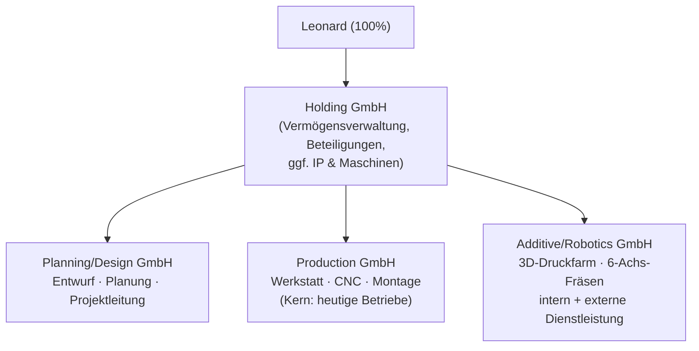

# 03 · Holdingstruktur

**Status:** In Arbeit · **Zuletzt aktualisiert:** 2026-07-18
> ⚠️ Keine Steuer-/Rechtsberatung — vor Umsetzung zwingend mit Steuerberater:in und Notar:in abstimmen.

## Zielstruktur



## Warum eine Holding?

1. **Steuerstundung / Thesaurierung (§ 8b KStG):** Gewinnausschüttungen der Töchter an die
   Holding sind zu 95 % körperschaftsteuerfrei (effektiv ~1,5 % Belastung). Gewinne können
   in der Holding gesammelt und für den **Kauf der zweiten Firma oder Investitionen
   (Roboter, Drucker) reinvestiert** werden, ohne dass vorher ~26–28 % Abgeltungsteuer/
   Teileinkünfte auf privater Ebene anfallen.
2. **Veräußerungsgewinne:** Verkauft die Holding später eine Tochter (oder einen
   Geschäftsbereich), ist der Gewinn ebenfalls zu 95 % steuerfrei — wichtig für
   Exit-Flexibilität einzelner Sparten.
3. **Haftungstrennung:** Ein Großprojekt-Schaden im Ausstellungsbau reißt nicht die
   Druckfarm mit. Maschinen/IP können in der Holding (oder einer Besitzgesellschaft)
   liegen und an die Töchter verpachtet werden → Anlagevermögen ist dem operativen
   Risiko entzogen. *(Achtung: Betriebsaufspaltung — steuerlich gestaltbar, aber
   beratungspflichtig.)*
4. **Struktur für gestaffelte Übernahmen:** Beteiligungen (z. B. erst 25 % an Firma B)
   hängen sauber unter der Holding; auch eine Minderheitsbeteiligung eines
   Mitarbeiters an einer einzelnen Tochter ist möglich, ohne die Gruppe zu verwässern.

## Wichtigster Punkt: Reihenfolge

**Die Holding wird gegründet, BEVOR der erste Unternehmenskauf stattfindet.**

- Kauft die Holding die Anteile direkt, gibt es keine Einbringungsproblematik.
- Werden Anteile erst privat gekauft und später in eine Holding eingebracht, greift
  **§ 22 UmwStG: 7 Jahre Sperrfrist** — ein Verkauf innerhalb dieser Frist wird rückwirkend
  (anteilig) auf privater Ebene besteuert. Das kostet Flexibilität und ist vermeidbar.
- Nebeneffekt: Eine bereits existierende Holding wirkt gegenüber Verkäufern und Banken
  professioneller.

→ **To-do noch während des Studiums möglich:** Gründung kostet wenig, laufende Kosten einer
inaktiven Holding sind überschaubar (s. u.).

## Strukturvarianten

### Variante A — Vollausbau (3 operative Töchter)
Wie im Zielbild. **Pro:** maximale Trennung, saubere Sparten-P&L, spätere Teilverkäufe einfach.
**Contra:** 4 × Buchhaltung/Jahresabschluss/IHK etc. — grob **[ANNAHME] 3.000–6.000 € p. a.
je GmbH** an Fixkosten (StB, Abschluss, Veröffentlichung) plus interner Verwaltungsaufwand;
Leistungsverrechnung zwischen den Gesellschaften nötig (Verrechnungspreise, Verträge).

### Variante B — Schlanker Start (empfohlen für Tag 1)
```
Holding GmbH
└── Operative GmbH (übernommener Betrieb; Planung + Produktion zusammen)
└── [später] Additive/Robotics GmbH
```
Die Robotik/3D-Druck-Sparte startet als **Geschäftsbereich oder Marke innerhalb der
operativen GmbH** und wird erst ausgegründet, wenn sie relevanten externen Umsatz macht
(Richtwert **[ANNAHME]: > 150–250 T€ Jahresumsatz** oder eigenes Personal/Maschinenrisiko).
**Pro:** minimale Fixkosten und Komplexität in der kritischsten Phase (Integration).
**Contra:** vorerst keine Haftungstrennung zwischen Sparten.

### Variante C — Zwei operative Töchter ab Fusion
Bei Übernahme beider Betriebe: beide zunächst als getrennte GmbHs unter der Holding
weiterführen (Marken, Verträge, Mitarbeiter bleiben unangetastet), Verschmelzung erst
nach 1–2 Jahren Integrationserfahrung. **Pro:** entkoppelt den Kauf vom Integrationsrisiko,
Rückabwicklung einzelner Teile bleibt möglich. **Contra:** doppelte Strukturen laufen länger.

**Empfehlung (Arbeitsstand):** B bzw. C — die Struktur wächst mit dem Geschäft, nicht umgekehrt.
Der Vollausbau (A) ist Zielbild, nicht Startaufstellung.

## Asset Deal vs. Share Deal (Kurzfassung)

| | Share Deal (GmbH-Anteile kaufen) | Asset Deal (Maschinen, Verträge, Name einzeln) |
|---|---|---|
| Käuferrisiko | Alle Altlasten wandern mit (Steuern, Gewährleistung) | Selektiv — Altlasten bleiben beim Verkäufer* |
| Abschreibung Kaufpreis | Nicht direkt abschreibbar | Kaufpreis auf Wirtschaftsgüter/Firmenwert → **abschreibbar** |
| Verträge/Kunden | Laufen automatisch weiter | Müssen einzeln übertragen werden |
| Mitarbeiter | Bleiben | Gehen per § 613a BGB automatisch mit über |
| Typisch bei | GmbHs mit sauberer Historie | GbR/Einzelunternehmen, unklare Historie |

\* Ausnahmen: § 75 AO (Betriebssteuern), § 613a BGB (Arbeitsverhältnisse).

**Relevanz hier:** IQ-Raumkonzepte war früher GbR → falls (noch) keine GmbH bzw. unklare Historie,
spricht viel für einen **Asset Deal** (Maschinen, Lager, Name). Bei Moser hängt es an der
Rechtsform und daran, wie sauber die Trennung vom früheren Mitgesellschafter vollzogen
wurde → **Due-Diligence-Punkt Nr. 1.**

## Laufende Struktur: Verträge innerhalb der Gruppe

- Geschäftsführervergütung: Leonard als GF der Holding, Anstellung dort; die Holding stellt
  GF-Leistung den Töchtern in Rechnung — **oder** direkte GF-Anstellung in den Töchtern
  (steuerlich/sozialversicherungsrechtlich gestalten, StB).
- Ggf. Organschaft (Gewinnabführungsvertrag, Mindestlaufzeit 5 Jahre) prüfen, wenn eine
  Tochter planmäßig Anlaufverluste macht (Additive/Robotics!) — Verluste wären dann mit
  Gewinnen der anderen verrechenbar. Sonst bleiben Verluste in der Tochter gefangen.
- Marken/IP (Name „Designbauwerke", Software, Druck-Workflows) in der Holding halten und
  lizenzieren.

## Offene Fragen

- [ ] Rechtsformen & Registerlage beider Zielfirmen bestätigen (→ Recherche/DD)
- [ ] StB-Termin: Betriebsaufspaltung Maschinen-Besitzgesellschaft ja/nein?
- [ ] Organschaft für Anlaufphase Additive/Robotics sinnvoll?
- [ ] Holding-Gründung schon 2026 aus Barcelona heraus? (Notartermin, Geschäftsanschrift)
- [ ] Firmierung: Arbeitstitel für Holding & Töchter sammeln
